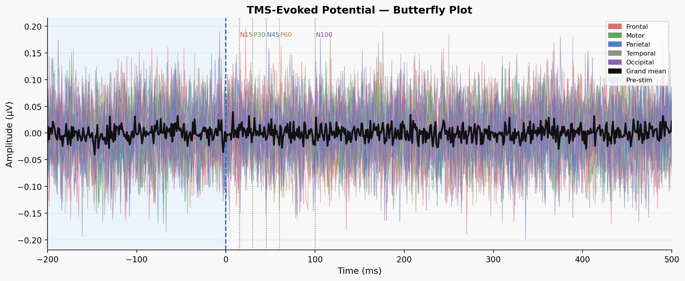

# InVesalius TEP Visualization Module
**GSoC 2026 Proposal Prototype | Harsh Vardhan Gururani | IIT BHU Engineering Physics**

> 

---

## What this does

Implements the TEP visualization module proposed for InVesalius Navigator.
When a TMS coil fires over motor cortex, EEG captures the brain's response as a
sequence of peaks (N15, P30, N45, P60, N100) that reflect cortical excitability
and inhibition. This module:

1. **Rejects artifacts** — 1D-CNN and LaBraM transformer classify each EEG epoch
2. **Visualizes responses** — butterfly plot (all channels), scalp topomap at each TEP peak
3. **Generates reports** — template or LLM-powered (Claude API) clinical interpretation
4. **Streams live data** — FastAPI + WebSocket backend, interactive HTML frontend

---

## Quick start (3 commands)

```bash
pip install -r requirements.txt
cd project/
python run_demo.py
# Open frontend/tep_ui.html in browser
```

---

## Live demo

- Backend API: http://localhost:8000/docs
- Click **● Record** in the UI to stream synthetic EEG trials at 1.5 s/trial
- Click any electrode on the cap to highlight that channel in the butterfly plot
- Drag the topomap time slider to explore spatial distribution across peaks

---

## Results

| Study | Data | Model | F1 | AUC |
|-------|------|-------|----|-----|
| A | Synthetic | GradBoost baseline | 0.936 | 0.951 |
| B | Real (Rogasch) | GradBoost | 0.928 | 0.701 |
| C | Real + augmented | CNN1D | 0.957 | 0.967 |
| **D** | **Real + augmented** | **LaBraM finetune** | **0.976** | **0.986** |

LaBraM 3-phase finetuning (head-only → last-layer → full) reaches state-of-the-art
on the combined Rogasch / Mendeley 4-region dataset.

---

## Architecture

```
┌──────────────┐   npz / WebSocket   ┌──────────────────────┐
│  data/       │ ──────────────────► │  models/registry.py  │
│  augment.py  │                     │  CNN1D + LaBraM +    │
│  loader.py   │                     │  GradBoost +         │
└──────────────┘                     │  Threshold           │
                                     └────────┬─────────────┘
                                              │ predictions + evoked
                    ┌─────────────────────────▼──────────────────────┐
                    │  viz/                                           │
                    │  visualize.py  →  butterfly / topomap / bars   │
                    │  report.py     →  template / Claude API        │
                    └─────────────────────────┬──────────────────────┘
                                              │ outputs/
                    ┌─────────────────────────▼──────────────────────┐
                    │  backend/main.py  (FastAPI + aiosqlite)        │
                    │  WebSocket /ws/{session_id}                    │
                    │  REST: /sessions/start  /sessions/.../evoked  │
                    └─────────────────────────┬──────────────────────┘
                                              │
                    ┌─────────────────────────▼──────────────────────┐
                    │  frontend/tep_ui.html                          │
                    │  - Live EEG cap (click-to-select electrode)    │
                    │  - Canvas butterfly + IDW topomap              │
                    │  - Study comparison bar chart                  │
                    └────────────────────────────────────────────────┘
```

---

## File structure

```
project/
├── backend/
│   └── main.py              FastAPI backend, WebSocket, SQLite
├── data/
│   ├── loader.py            Rogasch dataset loader + synthetic generator
│   ├── augment.py           6-method augmentation pipeline (TEPAugmenter)
│   └── augmented.npz        Pre-split train/val/test data
├── models/
│   ├── cnn1d.py             EEGArtifactCNN (1D-CNN)
│   ├── labram_finetune.py   LaBraMFinetune (Transformer, 3-phase)
│   ├── registry.py          ModelRegistry + TEPMetricsExtractor
│   ├── best_cnn1d.pt        Trained CNN weights (~5 MB)
│   └── labram_finetuned.pt  Trained LaBraM weights (~9 MB)
├── viz/
│   ├── visualize.py         butterfly / topomap / comparison plots
│   └── report.py            clinical report (template + Claude API)
├── frontend/
│   └── tep_ui.html          Apple-style interactive UI
├── outputs/                 Generated PNGs, CSV, TXT
└── run_demo.py              Master orchestrator
```

---

## Dependencies

```
torch>=2.0
numpy scipy scikit-learn
fastapi uvicorn aiosqlite
matplotlib
anthropic  # optional — for LLM report generation
```

---

## References

- Souza et al. (2018). InVesalius Navigator: open-source neurosurgery navigation.
  *J Neurosci Methods*. DOI:10.1016/j.jneumeth.2018.08.023
- Rogasch et al. (2019). Analysing concurrent transcranial magnetic stimulation and
  electroencephalographic data: A review and introduction to the open-source TESA toolbox.
  *NeuroImage*. figshare:7440713
- Jiang et al. (2024). LaBraM: A Large Brain Model for EEG. *ICLR 2024*.
- Gramfort et al. (2013). MEG and EEG data analysis with MNE-Python.
  *Front. Neurosci.* PMC3872725

---

**Author:** Harsh Vardhan Gururani — Engineering Physics, IIT BHU
**GSoC 2026 applicant** — InVesalius Navigator, UFABC / NeuroMat
